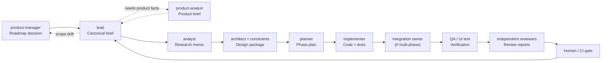
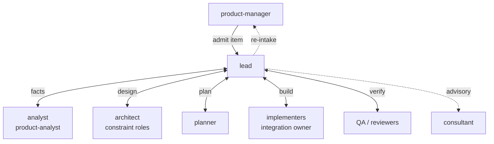
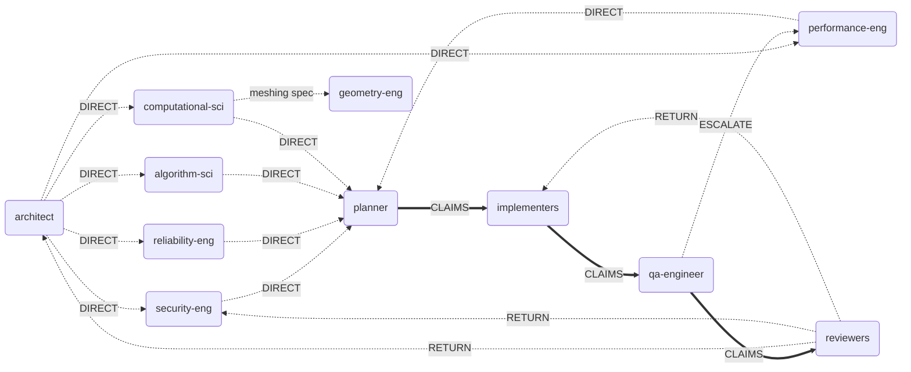
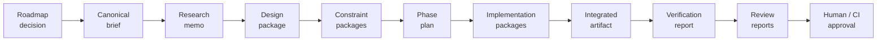
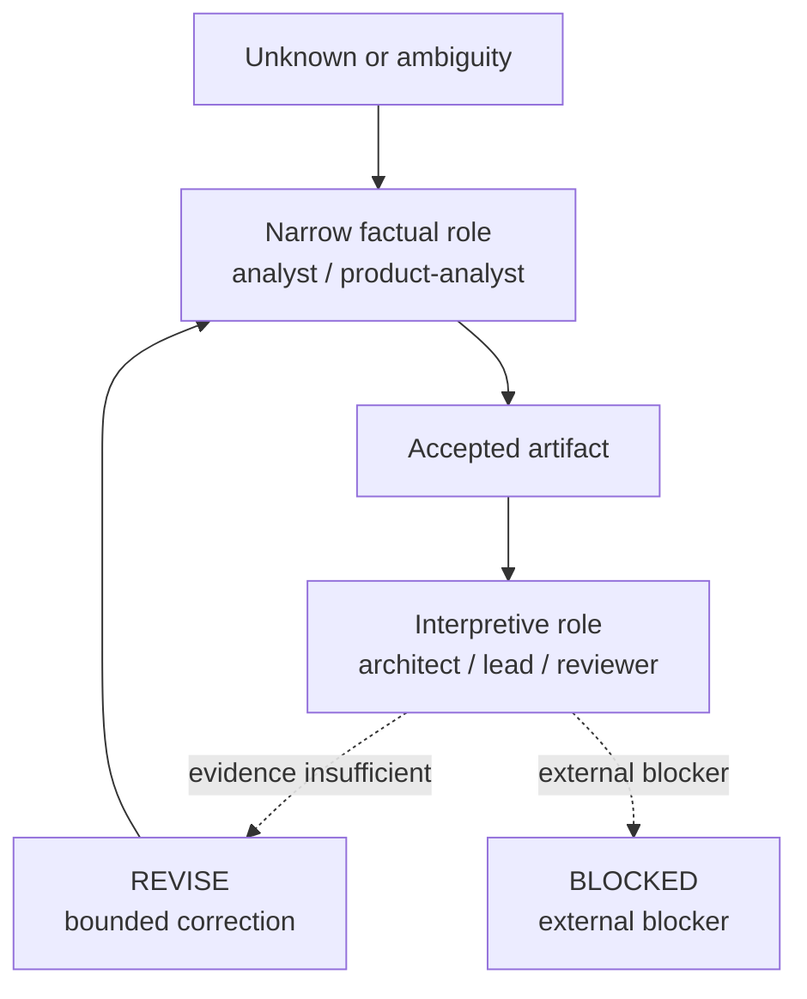
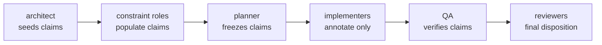

# Operating Model Diagram

This file provides a visual companion to [subagent-operating-model.md](subagent-operating-model.md).
Strategy comparison companion: [shared/references/workflow-strategy-comparison.md](../shared/references/workflow-strategy-comparison.md).

## 1. End-to-end operating flow

## 2. Hub-and-spoke topology

## 3. Direct peer edges (optimizations)

These edges complement hub-and-spoke. Lead remains orchestrating owner; direct edges require lead authorization.

## 4. Artifact progression

## 5. Delegation behavior

## 6. Workflow selection

| Situation | Strategy | Key roles |
| --- | --- | --- |
| What should enter delivery next? | Roadmap / Intake loop | `$product-manager`, `$product-analyst` |
| Approved item needs execution | Delivery loop | `$lead` -> research -> design -> plan -> implement -> QA/review |
| Next decision blocked by missing facts | Fact-first routing | `$analyst`, `$product-analyst`, specialist evidence lane |
| Domain risk can independently fail result | Risk-owner routing | Relevant constraint role + corresponding reviewer |
| Admitted item changed mid-delivery | Re-intake loop | `$lead` -> `$product-manager` -> `$lead` |
| Multiple phases must land together | Integration ownership | `$lead` + one integration owner |
| Known risk needs checking | Claim-Verify review | Builder (with claims list) + reviewer |
| Novel risk needs blind-spot hunting | Adversarial review | Reviewer only (no design package) |
| Need non-blocking second opinion | Consultant advisory | `$lead` -> `$consultant` |
| Independent read-heavy scopes | Parallel read lanes | Multiple research/triage roles |
| Independent write-heavy scopes (fixed contracts) | Parallel write lanes | Multiple implementers with disjoint ownership |

## 7. Role map

31 roles, 6 categories. Canonical core team only.

| Category | Roles |
| --- | --- |
| Coordination | `lead`, `product-manager`, `consultant` (advisory-only) |
| Research | `analyst`, `product-analyst` |
| Design / Constraints | `architect`, `ux-designer`, `algorithm-scientist`, `computational-scientist`, `security-engineer`, `performance-engineer`, `reliability-engineer` |
| Plan | `planner` |
| Implement | `backend-engineer`, `frontend-engineer`, `data-engineer`, `platform-engineer`, `toolchain-engineer`, `graphics-engineer`, `visualization-engineer`, `geometry-engineer`, `qt-ui-engineer`, `model-view-engineer`, `knowledge-archivist` |
| QA + Review | `qa-engineer`, `ui-test-engineer`, `architecture-reviewer`, `performance-reviewer`, `security-reviewer`, `ux-reviewer`, `accessibility-reviewer` |

Notes:

- `knowledge-archivist` is cross-cutting hygiene, usually invoked outside the main feature phase.
- `consultant` is advisory-only and never becomes a reviewer or approver; ordinary consultant use is optional, and a closeout consultant sweep should run only when explicitly requested or required by repo-local policy while `consultantMode` is enabled.

## 8. Claims chain

The claims chain is a traveling artifact that ensures builder claims reach reviewers reliably.

Lifecycle of `constraints/claims.md` in the work-item folder:

1. **Created** after design acceptance — architect seeds initial constraints.
2. **Populated** by each constraint role as they complete.
3. **Frozen** by the planner before implementation. The plan references the claims list.
4. **Annotated** by each implementer — verification notes only, cannot modify claims.
5. **Verified** by QA — each claim receives a verification status.
6. **Reviewed** by each independent reviewer — primary input for Claim-Verify.
7. **Returned** to lead — final claims disposition with pass/fail per review domain.

## 9. Key rules

- `product-manager` owns what enters delivery. `lead` owns execution of approved work.
- `analyst` and `product-analyst` reduce uncertainty before interpretive roles make tradeoff decisions.
- Delegation passes accepted artifacts, not raw transcripts.
- `REVISE` returns work to the responsible role for up to 3 iterations; after 3, escalate to the user. `BLOCKED` stops progression — classified as `BLOCKED:dependency` (external blocker) or `BLOCKED:prerequisite` (adjacent work needed first).
- Multi-phase implementation requires one explicit integration owner before QA.
- Reviewers stay independent and report to the orchestrating owner.
- Interaction types: `LEAD_MED` (default), `DIRECT`, `PARALLEL`, `CLAIMS`, `RETURN`, `ESCALATE`, `ADVISORY`, `NONE`.
- Reviewers tag cross-domain findings with `[CROSS-DOMAIN: <target-domain>]`; the orchestrator routes them to the appropriate specialist.
- Any role files adjacent findings in `work-items/bugs/` using the bug registry format, with `context: adjacent-finding` and `status: open`, without expanding scope.
- Every completed chain persists artifacts: canonical docs in `work-items/`, session logs in `.reports/`, plan logs in `.plans/`.
- Parallel agents must have non-overlapping change surfaces; an integration check runs after all parallel agents complete.
