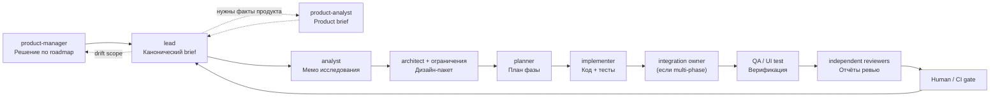
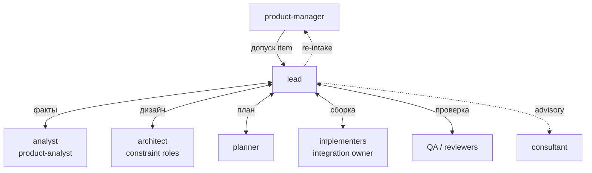
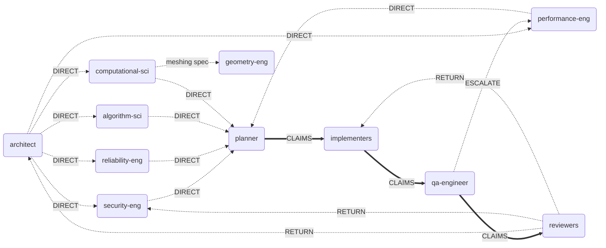
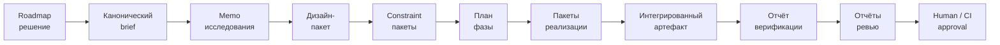
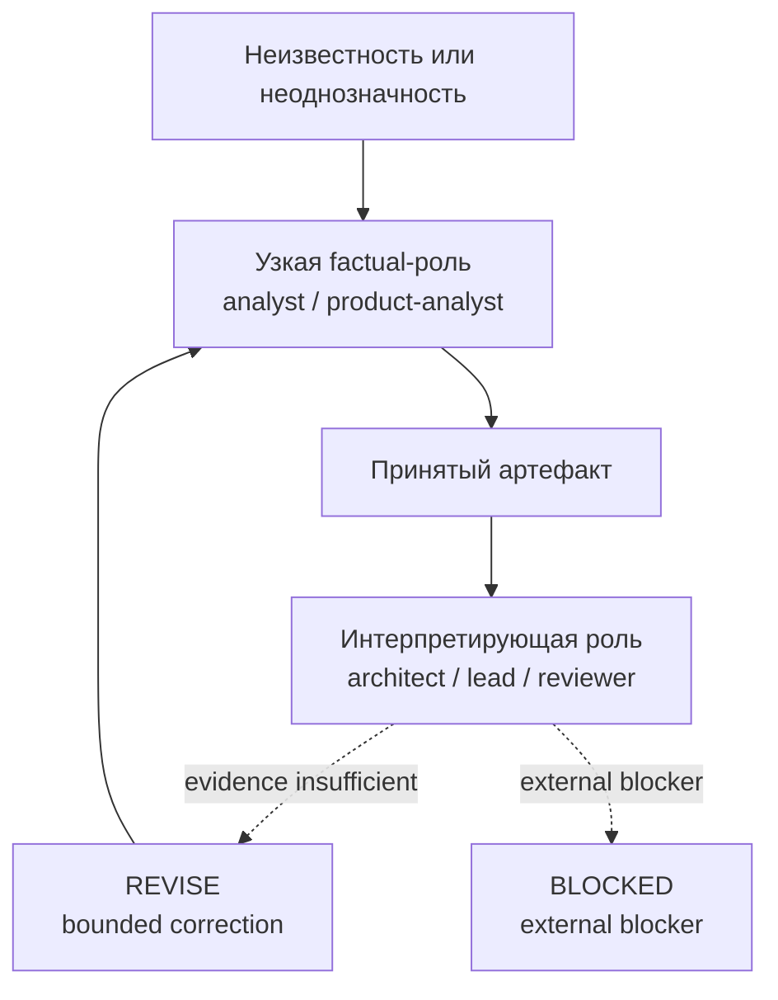
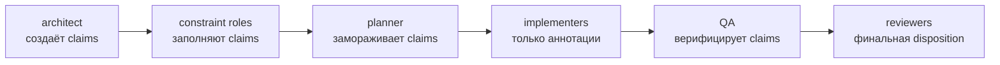

# Диаграмма operating model

Этот файл — визуальное дополнение к [subagent-operating-model.md](subagent-operating-model.md).
Справочник по стратегиям: [workflow-strategy-comparison.md](workflow-strategy-comparison.md).

## 1. Сквозной operating flow

## 2. Топология hub-and-spoke

## 3. Прямые peer-рёбра (оптимизации)

Дополняют hub-and-spoke. Lead остаётся оркестрирующим владельцем; прямые рёбра требуют утверждения lead по самому ребру, scope и границе артефакта.

## 4. Прогрессия артефактов

## 5. Поведение делегирования

## 6. Таблица выбора workflow

| Ситуация | Стратегия | Ключевые роли |
| --- | --- | --- |
| Что должно войти в delivery? | Roadmap / Intake loop | `$product-manager`, `$product-analyst` |
| Утверждённый item требует исполнения | Delivery loop | `$lead` -> research -> design -> plan -> implement -> QA/review -> lead |
| Решение блокировано нехваткой фактов | Fact-first routing | `$analyst`, `$product-analyst`, specialist evidence lane |
| Domain risk может независимо провалить результат | Risk-owner routing | Релевантная constraint role + reviewer |
| Admitted item изменился mid-delivery | Re-intake loop | `$lead` -> `$product-manager` -> `$lead` |
| Несколько фаз должны слиться | Integration ownership | `$lead` + один integration owner |
| Известный risk нужно проверить | Claim-Verify review | Builder (с claims list) + reviewer |
| Новый risk требует поиска blind spots | Adversarial review | Reviewer only (без design package) |
| Нужно non-blocking второе мнение | Consultant advisory | `$lead` -> `$consultant` |
| Независимые read-heavy области | Parallel read lanes | Несколько research/triage ролей |
| Независимые write-heavy области (contracts fixed) | Parallel write lanes | Несколько implementers с раздельным ownership |

## 7. Карта ролей

31 роль, 6 категорий. Только canonical core team.

| Категория | Роли |
| --- | --- |
| Координация | `lead`, `product-manager`, `consultant` (advisory-only) |
| Исследование | `analyst`, `product-analyst` |
| Дизайн / ограничения | `architect`, `ux-designer`, `algorithm-scientist`, `computational-scientist`, `security-engineer`, `performance-engineer`, `reliability-engineer` |
| Планирование | `planner` |
| Реализация | `backend-engineer`, `frontend-engineer`, `data-engineer`, `platform-engineer`, `toolchain-engineer`, `graphics-engineer`, `visualization-engineer`, `geometry-engineer`, `qt-ui-engineer`, `model-view-engineer`, `knowledge-archivist` |
| QA + ревью | `qa-engineer`, `ui-test-engineer`, `architecture-reviewer`, `performance-reviewer`, `security-reviewer`, `ux-reviewer`, `accessibility-reviewer` |

Примечания:

- `knowledge-archivist` — сквозная hygiene-роль, обычно вызывается вне основной feature-фазы.
- `consultant` — advisory-only, не становится обязательным delivery gate.

## 8. Цепочка claims

Цепочка claims — traveling artifact, гарантирующий доставку claims builder'ов до reviewers.

Жизненный цикл `constraints/claims.md` в папке work-item:

1. **Создаётся** после acceptance дизайна — architect заполняет начальными constraints.
2. **Заполняется** каждым constraint-ролем по мере завершения.
3. **Замораживается** planner'ом до начала implementation. План ссылается на claims list.
4. **Аннотируется** каждым implementer'ом — только verification notes, нельзя менять claims.
5. **Верифицируется** QA — каждый claim получает статус верификации.
6. **Ревьюится** каждым независимым reviewer — основной вход для Claim-Verify стратегии.
7. **Возвращается** lead — финальная disposition claims с pass/fail по каждому review domain.

## 9. Ключевые правила

- `product-manager` владеет тем, что входит в delivery. `lead` владеет исполнением утверждённой работы.
- `analyst` и `product-analyst` снижают неопределённость до того, как interpretive роли примут tradeoff-решения.
- Делегирование передаёт принятые артефакты, не сырые транскрипты.
- `REVISE` возвращает работу ответственной роли, до 3 итераций; после 3 — эскалация пользователю. `BLOCKED` останавливает progression — классифицируется как `BLOCKED:dependency` (внешний блокер) или `BLOCKED:prerequisite` (нужна смежная работа).
- Multi-phase implementation требует одного explicit integration owner до QA.
- Reviewer'ы остаются независимыми и отчитываются оркестрирующему owner'у.
- Типы взаимодействий: `LEAD_MED` (дефолт), `DIRECT`, `PARALLEL`, `CLAIMS`, `RETURN`, `ESCALATE`, `ADVISORY`, `NONE`.
- Reviewer'ы тегируют cross-domain находки как `[CROSS-DOMAIN: <target-domain>]`; оркестратор маршрутизирует их соответствующему специалисту.
- Любая роль фиксирует смежные находки в `work-items/bugs/`, используя bug registry format, с `context: adjacent-finding` и `status: open`, без расширения scope.
- Каждая завершённая цепочка сохраняет артефакты: каноническая документация в `work-items/`, логи сессий в `.reports/`, логи планов в `.plans/`.
- Параллельные агенты должны иметь непересекающиеся change surfaces; после завершения всех параллельных агентов проводится интеграционная проверка.
