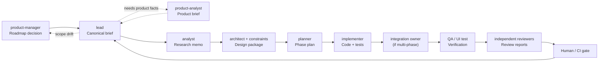
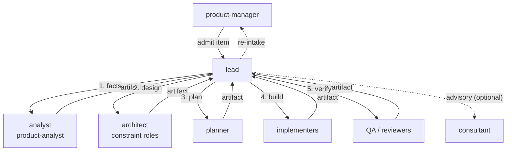
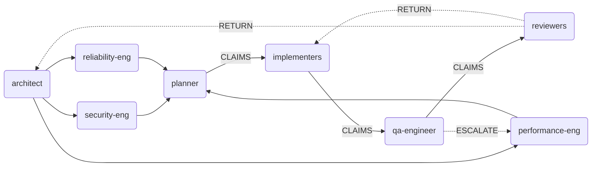
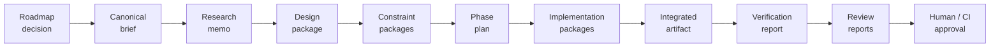
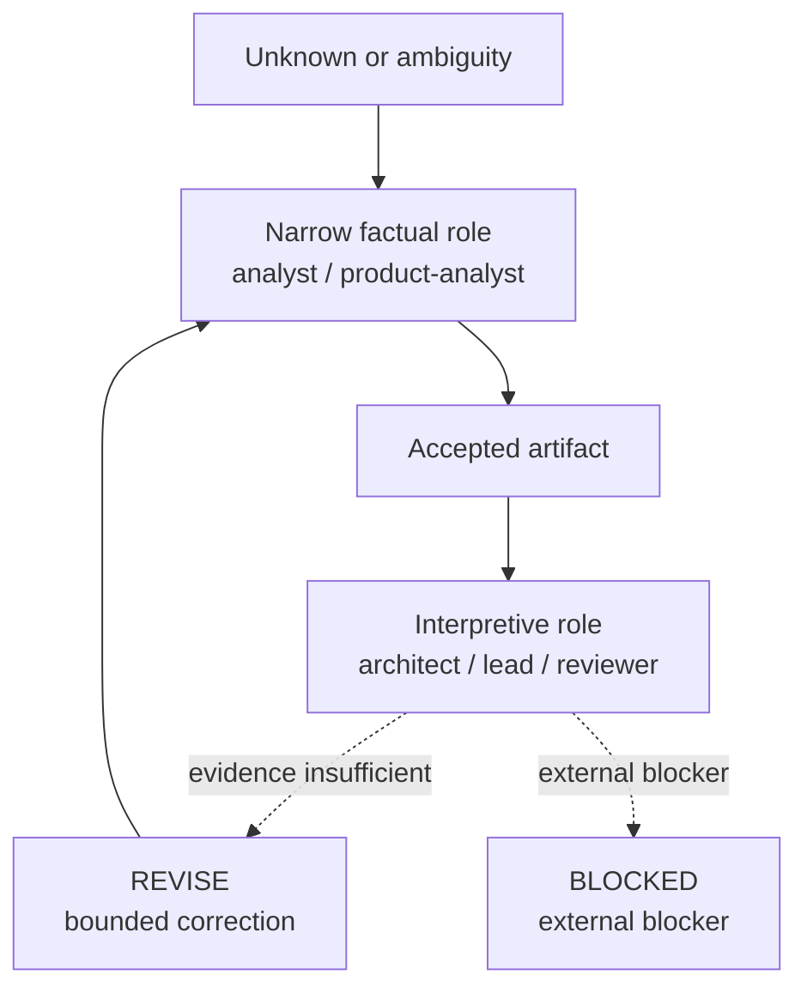
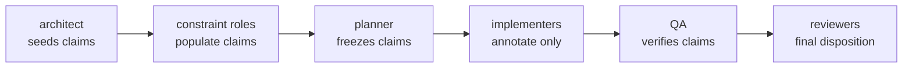

# Operating Model Diagram

This file provides a visual companion to [subagent-operating-model.md](subagent-operating-model.md).
Strategy comparison companion: [shared/references/workflow-strategy-comparison.md](../shared/references/workflow-strategy-comparison.md).

**Platform note:** Codex native subagent dispatch is available when the current host exposes it. The diagrams show rolling admission of independent lane-ready work against current host capacity; dependency edges and shared integration surfaces still serialize execution.

> **The `lead` / `M` / `L` node denotes the orchestration role the main Codex session holds with the `$lead` skill active, not a separately activated agent.** Only the leaf specialist roles are activated per stage; `lead` is the main session running that orchestration.

## 1. End-to-end operating flow

```mermaid
flowchart LR
    PM["product-manager\nRoadmap decision"] --> M["lead\nCanonical brief"]
    PA["product-analyst\nProduct brief"] -.-> M

    M --> A["analyst\nResearch memo"]
    A --> D["architect + constraints\nDesign package"]
    D --> P["planner\nPhase plan"]
    P --> I["implementer\nCode + tests"]
    I --> INT["integration owner\n(if multi-phase)"]
    INT --> QA["QA / UI test\nVerification"]
    QA --> R["independent reviewers\nReview reports"]
    R --> H["Human / CI gate"]
    H --> M

    M -. "scope drift" .-> PM
    M -. "needs product facts" .-> PA
```

## 2. Rolling hub-and-spoke topology

Lead owns admission and handoff. It launches the largest useful pairwise-compatible subset of ready lanes that current host capacity permits, recomputes after each launch or settled lane, and refills released capacity in the same turn. A dependency must still return its accepted artifact before its consumer starts.

```mermaid
flowchart TB
    PM["product-manager"] -->|"admit item"| L["lead"]
    L -. "re-intake" .-> PM

    L -->|"1. facts"| AN["analyst\nproduct-analyst"]
    AN -->|"artifact"| L
    L -->|"2. design"| AR["architect\nconstraint roles"]
    AR -->|"artifact"| L
    L -->|"3. plan"| PL["planner"]
    PL -->|"artifact"| L
    L -->|"4. build"| IM["implementers"]
    IM -->|"artifact"| L
    L -->|"5. verify"| QA["QA / reviewers"]
    QA -->|"artifact"| L
    L -. "advisory (optional)" .-> CO["consultant"]
```

## 3. Dependency and independent-lane dispatch

After architecture acceptance, independent constraint lanes may run concurrently when their full resource surfaces are disjoint and the host admits them. Lead serializes dependencies, integration-owner work, and overlapping resource surfaces.

```mermaid
flowchart LR
    AR("architect") --> SE("security-eng")
    AR --> PE("performance-eng")
    AR --> RE("reliability-eng")

    SE --> PL("planner")
    PE --> PL
    RE --> PL

    PL -->|"CLAIMS"| IM("implementers")
    IM -->|"CLAIMS"| QA("qa-engineer")
    QA -->|"CLAIMS"| RV("reviewers")

    QA -. "ESCALATE" .-> PE
    RV -. "RETURN" .-> AR
    RV -. "RETURN" .-> IM
```

Note: if a project requires algorithm-scientist, computational-scientist, or ux-designer constraints, each joins the same lane-ready admission set when independent. The planner waits for every required accepted constraint artifact.

## 4. Artifact progression

```mermaid
flowchart LR
    R0["Roadmap\ndecision"] --> R1["Canonical\nbrief"]
    R1 --> R2["Research\nmemo"]
    R2 --> R3["Design\npackage"]
    R3 --> R4["Constraint\npackages"]
    R4 --> R5["Phase\nplan"]
    R5 --> R6["Implementation\npackages"]
    R6 --> R7["Integrated\nartifact"]
    R7 --> R8["Verification\nreport"]
    R8 --> R9["Review\nreports"]
    R9 --> R10["Human / CI\napproval"]
```

## 5. Delegation behavior

```mermaid
flowchart TB
    U["Unknown or ambiguity"]
    F["Narrow factual role\nanalyst / product-analyst"]
    AF["Accepted artifact"]
    I["Interpretive role\narchitect / lead / reviewer"]
    R["REVISE\nbounded correction"]
    B["BLOCKED\nexternal blocker"]

    U --> F --> AF --> I
    I -. "evidence insufficient" .-> R --> F
    I -. "external blocker" .-> B
```

## 6. Workflow selection

| Situation | Strategy | Key roles |
| --- | --- | --- |
| What should enter delivery next? | Roadmap / Intake loop | `$product-manager`, `$product-analyst` |
| Approved item needs execution | Delivery loop (rolling) | `$lead` admits ready research, design, plan, implement, and QA/review lanes as their prerequisites settle |
| Next decision blocked by missing facts | Fact-first routing | `$analyst`, `$product-analyst`, specialist evidence lane |
| Domain risk can independently fail result | Risk-owner routing | Relevant independent constraint lanes, then corresponding reviewers after implementation |
| Admitted item changed mid-delivery | Re-intake loop | `$lead` -> `$product-manager` -> `$lead` |
| Multiple phases must land together | Integration ownership | `$lead` + one integration owner |
| Known risk needs checking | Claim-Verify review | Builder (with claims list) + reviewer |
| Novel risk needs blind-spot hunting | Adversarial review | Reviewer only (no design package) |
| Need non-blocking second opinion | Consultant advisory | `$lead` -> `$consultant` |
| Independent read-heavy scopes | Rolling fact-gathering | Admit the largest useful compatible ready subset within current host capacity |
| Independent write-heavy scopes (fixed contracts) | Isolated rolling implementation | Admit only disjoint or explicitly isolated lanes; serialize shared integration surfaces |

## 7. Role map

31 roles, 6 categories. Canonical core team only.

| Category | Roles |
| --- | --- |
| Coordination | `lead`, `product-manager`, `consultant` (advisory-only) |
| Research | `analyst`, `product-analyst` |
| Design / Constraints | `architect`, `ux-designer`, `algorithm-scientist`, `computational-scientist`, `security-engineer`, `performance-engineer`, `reliability-engineer` |
| Plan | `planner` |
| Implement | `backend-engineer`, `frontend-engineer`, `data-engineer`, `platform-engineer`, `toolchain-engineer`, `graphics-engineer`, `visualization-engineer`, `geometry-engineer`, `qt-ui-engineer`, `model-view-engineer`, `knowledge-archivist` |
| QA + Review | `qa-engineer`, `ui-test-engineer`, `architecture-reviewer`, `performance-reviewer`, `security-reviewer`, `ux-reviewer`, `accessibility-reviewer` |

Notes:

- `knowledge-archivist` is cross-cutting hygiene, usually invoked outside the main feature phase.
- `consultant` is advisory-only and never becomes a reviewer or approver; ordinary consultant use is optional, and a closeout consultant sweep should run only when explicitly requested or required by repo-local policy while `consultantMode` is enabled.

## 8. Claims chain

The claims chain is a traveling artifact that ensures builder claims reach reviewers reliably.

```mermaid
flowchart LR
    A["architect\nseeds claims"] --> C["constraint roles\npopulate claims"]
    C --> PL["planner\nfreezes claims"]
    PL --> IM["implementers\nannotate only"]
    IM --> QA["QA\nverifies claims"]
    QA --> RV["reviewers\nfinal disposition"]
```

Lifecycle of `constraints/claims.md` in the work-item folder:

1. **Created** after design acceptance — architect seeds initial constraints.
2. **Populated** as required constraint lanes settle; independent lanes may overlap, while dependencies stay ordered.
3. **Frozen** by the planner before implementation. The plan references the claims list.
4. **Annotated** by each implementer — verification notes only, cannot modify claims.
5. **Verified** by QA — each claim receives a verification status.
6. **Reviewed** by each independent reviewer — primary input for Claim-Verify.
7. **Returned** to lead — final claims disposition with pass/fail per review domain.

## 9. Key rules

- `product-manager` owns what enters delivery. `lead` owns execution of approved work.
- `analyst` and `product-analyst` reduce uncertainty before interpretive roles make tradeoff decisions.
- Delegation passes accepted artifacts, not raw transcripts.
- **Codex rolling model:** native subagents may run concurrently when the current host exposes capacity. Lead admits pairwise-compatible lane-ready work, recomputes after every launch or settlement, and never caches a numeric concurrency limit.
- `REVISE` returns work to the responsible role under the shared spine's consecutive same-role/same-artifact cycle cap; escalate to the user when it is exhausted. `BLOCKED` stops progression — classified as `BLOCKED:dependency` (external blocker) or `BLOCKED:prerequisite` (adjacent work needed first).
- Multi-phase implementation requires one explicit integration owner before QA.
- Reviewers stay independent and report to the orchestrating owner.
- Interaction types: `LEAD_MED` (default), `DIRECT`, `PARALLEL` (independent, lane-ready, host-admitted), `CLAIMS`, `RETURN`, `ESCALATE`, `ADVISORY`, `NONE`.
- Reviewers tag cross-domain findings with `[CROSS-DOMAIN: <target-domain>]`; the orchestrator routes them to the appropriate specialist.
- Any role files adjacent findings in `work-items/bugs/` without expanding scope.
- An active task persists canonical artifacts only in `work-items/active/<slug>/` plus its root ledger; `.reports/` and `.plans/` are optional standalone surfaces when no active item exists.

## Terms and Abbreviations

- `CI`: Continuous Integration; automated repository checks run before merge, push, or release.
- `Claim-Verify`: a reviewer mode in which the reviewer checks the builder's explicit claims against evidence.
- `Codex`: the OpenAI Codex runtime used by this pack as a code-generation and task-execution engine.
- `QA`: Quality Assurance; the verification stage for behavior, acceptance criteria, and regressions.
- `REVISE`: a gate result meaning bounded correction is required; work returns to the same role for up to three consecutive cycles.
- `UI`: User Interface; the user-facing interaction surface.
- `UX`: User Experience; usability, flow, comprehension, and interaction quality.
