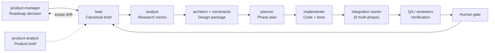
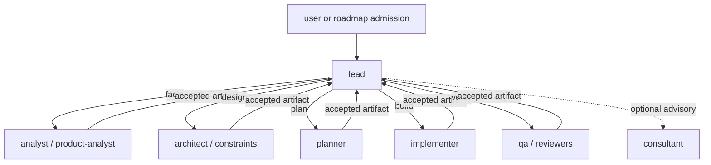

# Operating Model Diagram

This file provides a visual companion to [subagent-operating-model.md](subagent-operating-model.md).
Strategy comparison companion: [workflow-strategy-comparison.md](workflow-strategy-comparison.md).

Platform note: this standalone Gemini pack keeps execution sequential and human-steered. The diagrams below show the intended governance flow, not a promise of native parallel dispatch.

## 1. End-to-end operating flow

## 2. Sequential handoff topology

## 3. Minimal rules

- Keep runtime surfaces official-first: `GEMINI.md`, `/init`, and `.gemini/settings.json`.
- Keep Orchestrarium routing overlays in `.gemini/.agents-mode`.
- Keep maintainer-side governance references in `references-gemini/`.
