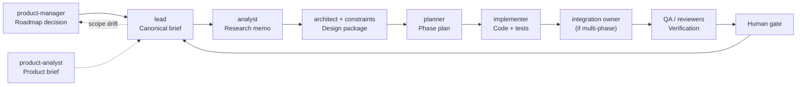
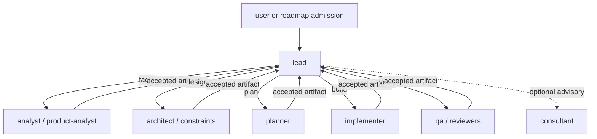

# Диаграмма operating model

Этот файл является визуальным дополнением к [subagent-operating-model.md](subagent-operating-model.md).
Справочник по стратегиям: [workflow-strategy-comparison.md](workflow-strategy-comparison.md).

Platform note: текущий standalone Gemini pack остаётся последовательным и human-steered. Диаграммы ниже показывают целевую governance-модель, а не обещание native parallel dispatch.

## 1. Сквозной поток работы

## 2. Последовательная topology handoff

## 3. Минимальные правила

- Держите runtime surfaces official-first: `GEMINI.md`, `/init` и `.gemini/settings.json`.
- Держите Orchestrarium routing overlays в `.gemini/.agents-mode`.
- Держите maintainer-side governance references в `references-gemini/`.
