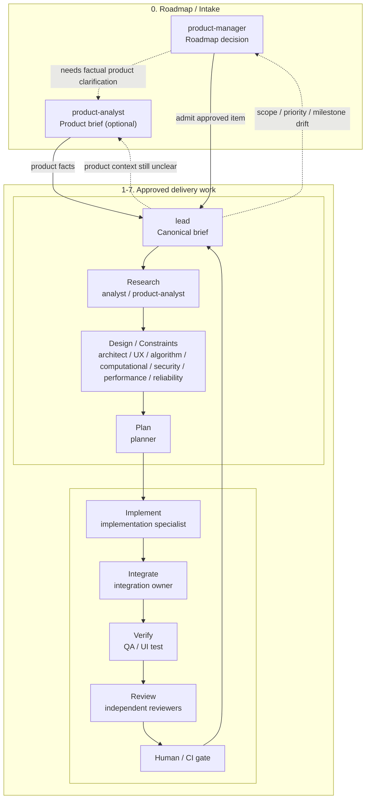
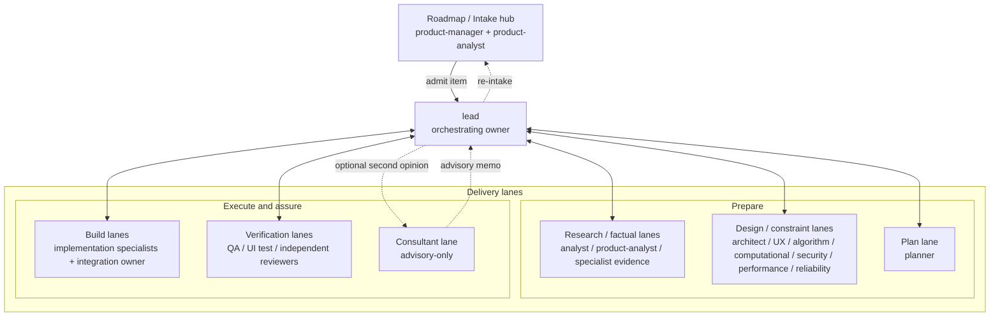
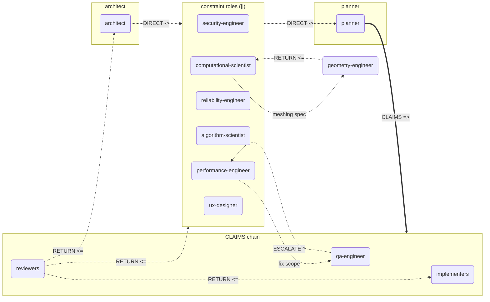
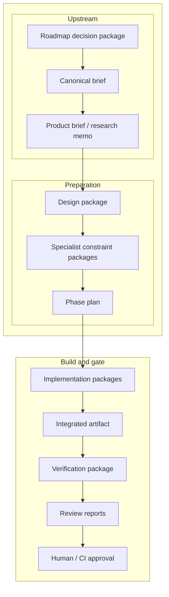
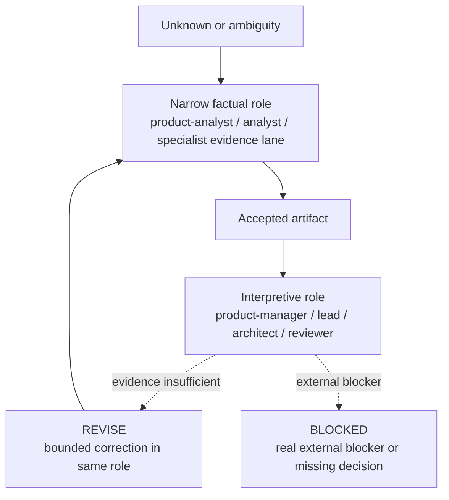

# Operating Model Diagram

This file provides a visual companion to [subagent-operating-model.md](subagent-operating-model.md).
Strategy comparison companion: [workflow-strategy-comparison.md](workflow-strategy-comparison.md).

## 1. End-to-end operating flow

## 2. Interaction topology (hub-and-spoke)

## 3. Interaction topology (peer-to-peer)

This diagram complements the hub-and-spoke view in Section 2 with the high-value peer-to-peer edges enabled by the optimized interaction matrix. The lead remains the orchestrating owner; direct edges are optimizations, not replacements.

## 4. Artifact progression

## 5. Delegation behavior

## 6. Workflow selection matrix

| Situation | Default strategy | Primary roles | Expected accepted artifact | Escalate when |
|-----------|------------------|---------------|----------------------------|---------------|
| What should enter discovery or delivery next? | `Roadmap / Intake loop` | `$product-manager`, `$product-analyst` as needed | Roadmap decision package, then optional product brief | Product facts are unclear or milestone intent is unstable |
| Approved item needs normal execution | `Delivery loop` | `$lead -> analyst -> architect -> planner -> implementation -> QA/review` | Canonical brief, research memo, design package, phase plan, implementation and verification artifacts | A critical risk lane or reviewer becomes mandatory |
| The next decision is blocked by missing facts | `Fact-first routing` | `$analyst`, `$product-analyst`, or a narrow specialist evidence lane | Accepted factual artifact | Interpretive roles are being asked to guess instead of consume evidence |
| A domain risk can independently fail the result | `Risk-owner routing` | `$security-engineer`, `$performance-engineer`, `$reliability-engineer`, `$algorithm-scientist`, `$computational-scientist`, `$ux-designer`, or another explicit owner | One specialist design or constraint package | The risk is being left implicit inside general implementation |
| The admitted item has changed materially mid-delivery | `Re-intake loop` | `$lead -> $product-manager -> $lead` | Updated roadmap decision package or re-admission decision | Scope, priority, or milestone intent no longer matches the admitted item |
| Multiple implementation phases or specialists must land together | `Integration ownership` | `$lead` plus one explicit integration owner | One integrated artifact ready for QA | QA would otherwise receive a partial multi-phase result |
| A known bounded risk needs independent checking | `Claim-Verify review` | Upstream builder plus the relevant independent reviewer | Implementation artifact plus claims list, then review report | The reviewer needs to verify stated guarantees and coverage gaps |
| A novel or externally exposed risk needs blind-spot hunting | `Adversarial review` | Relevant independent reviewer | Review report against the implementation artifact only | Missing an unknown risk is more dangerous than missing an execution bug |
| A change needs independence between builder and gate | `Builder / blocker separation` | Builder role plus reviewer/blocker role | Builder artifact, then independent review artifact | The builder would otherwise approve the same risk they introduced |
| Ambiguity or tradeoffs need a non-blocking second opinion | `Consultant advisory` | `$lead -> $consultant` | Advisory memo | Facts are already assembled, but route choice is still ambiguous |
| Read-heavy scopes are independent | `Parallel read lanes` | Multiple research, triage, or test-analysis roles | Multiple independent factual artifacts | Merge cost would exceed the time saved |
| Write-heavy scopes are independent and contracts are fixed | `Parallel write lanes` | Multiple implementation roles with disjoint ownership | Multiple implementation artifacts with fixed boundaries | Write scopes overlap or contracts are still moving |
| Constraint roles run independently after design acceptance | Parallel constraint aggregation | `architect` dispatches constraint roles in parallel; outputs aggregate at planner | Unified constraint picture | Planner cannot reconcile conflicting constraints |
| Review finding maps to upstream specialist structural gap | RETURN escalation | Reviewer names specific specialist; lead notified but does not re-interpret | Structural gap corrected by correct upstream owner | Finding is bounded and fixable by implementer |

## 7. Role map by category

Current team shape: `31 roles`, `6 categories`.

Note: this role map shows the canonical core team only; installed or repo-local specialists are not listed here.

| Category | Roles |
|----------|-------|
| Coordination | `lead`, `product-manager`, `consultant` (advisory-only) |
| Research | `analyst`, `product-analyst` |
| Design / Constraints | `architect`, `ux-designer`, `algorithm-scientist`, `computational-scientist`, `security-engineer`, `performance-engineer`, `reliability-engineer` |
| Plan | `planner` |
| Implement | `backend-engineer`, `frontend-engineer` (web/React UI), `data-engineer`, `platform-engineer`, `toolchain-engineer`, `graphics-engineer`, `visualization-engineer`, `geometry-engineer`, `qt-ui-engineer` (Qt desktop UI), `model-view-engineer`, `knowledge-archivist` |
| QA + Review | `qa-engineer`, `ui-test-engineer`, `architecture-reviewer`, `performance-reviewer`, `security-reviewer`, `ux-reviewer`, `accessibility-reviewer` |

Notes:
- `knowledge-archivist` is a cross-cutting hygiene lane and is usually invoked outside the main feature phase even though it sits closest to implementation support.
- `consultant` is advisory-only and does not become a required delivery gate.

## 8. Reading notes

- `product-manager` owns what enters discovery or delivery.
- `lead` owns execution of approved work.
- `ux-designer` owns scoped interaction design before implementation when the UI surface needs dedicated UX ownership.
- If an in-flight item no longer fits its admitted scope, priority, or milestone intent, `lead` routes it back to `product-manager` for re-intake.
- `analyst` and `product-analyst` should reduce uncertainty before interpretive roles make tradeoff decisions.
- Delegation should reduce noise: pass accepted artifacts, not raw transcript dumps, whenever an accepted artifact already exists.
- Interpretive roles should consume accepted evidence instead of filling factual gaps with judgment.
- Subagents exchange accepted artifacts, not direct peer task assignments.
- `$consultant` stays advisory-only whether it is fulfilled by an external provider or by an internal independent subagent fallback.
- Multi-phase or multi-specialist implementation requires one explicit integration owner before QA.
- Reviewers stay independent and report to the orchestrating owner.
- `REVISE` returns work to the same stage owner for up to 2 consecutive cycles on the same role and artifact; `BLOCKED` stops progression until a new decision or artifact exists.

## 9. Claims chain

The claims chain is a traveling artifact that ensures builder claims reach reviewers reliably, regardless of lead mediation between stages.

When a work-item requires Claim-Verify review, a `constraints/claims.md` file is created in the work-item folder. Its lifecycle:

1. **Created** after design acceptance — architect seeds the file with initial constraints.
2. **Populated** by each constraint role (security-engineer, performance-engineer, reliability-engineer, algorithm-scientist, computational-scientist) as they complete.
3. **Frozen** by the planner before implementation begins. The plan references the claims list.
4. **Annotated** by each implementer — verification notes only, cannot modify constraint claims.
5. **Verified** by QA — each claim receives a verification status.
6. **Reviewed** by each independent reviewer — the claims list is primary input for Claim-Verify.
7. **Returned** to lead — final claims disposition with pass/fail per review domain.

## 10. Role map note — interaction types

The role categories in Section 7 remain unchanged. Role interactions are now classified by type (`LEAD_MED`, `DIRECT`, `PARALLEL`, `CLAIMS`, `RETURN`, `ESCALATE`, `ADVISORY`, `NONE`) rather than assuming all interactions go through lead. The full role-pair interaction matrix lives in the work-item design document: `work-items/active/2026-04-06-optimize-interaction-matrix/design.md`.
