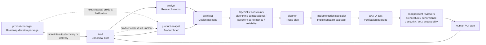
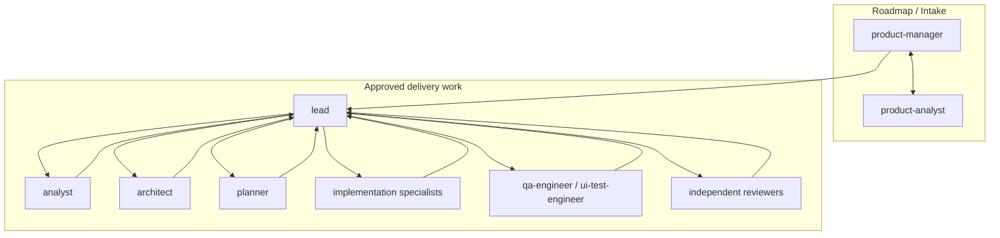
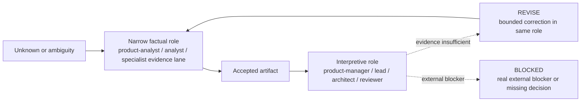

# Operating Model Diagram

This file provides a visual companion to [subagent-operating-model.md](subagent-operating-model.md).

## 1. End-to-end operating flow

## 2. Interaction topology

## 3. Artifact progression

```mermaid
flowchart LR
    R0["Roadmap decision package"]
    R1["Canonical brief"]
    R2["Product brief / Research memo"]
    R3["Design package"]
    R4["Specialist constraint packages"]
    R5["Phase plan"]
    R6["Implementation package"]
    R7["Verification package"]
    R8["Review reports"]
    R9["Human / CI approval"]

    R0 --> R1
    R1 --> R2
    R2 --> R3
    R3 --> R4
    R4 --> R5
    R5 --> R6
    R6 --> R7
    R7 --> R8
    R8 --> R9
```

## 4. Delegation behavior

## Reading notes

- `product-manager` owns what enters discovery or delivery.
- `lead` owns execution of approved work.
- `analyst` and `product-analyst` should reduce uncertainty before interpretive roles make tradeoff decisions.
- Delegation should reduce noise: pass accepted artifacts, not raw transcript dumps, whenever an accepted artifact already exists.
- Interpretive roles should consume accepted evidence instead of filling factual gaps with judgment.
- Subagents exchange accepted artifacts, not direct peer task assignments.
- Reviewers stay independent and report to the orchestrating owner.
- `REVISE` returns work to the same stage owner; `BLOCKED` stops progression until a new decision or artifact exists.
