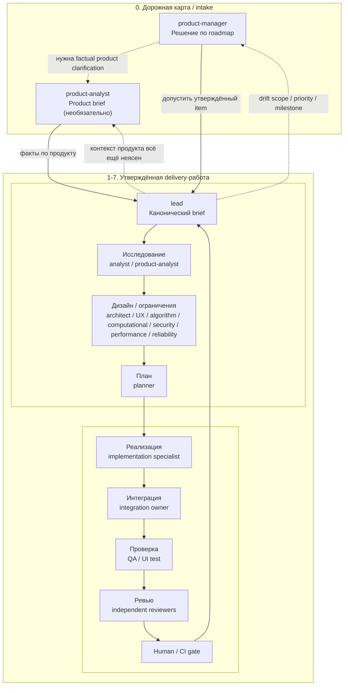
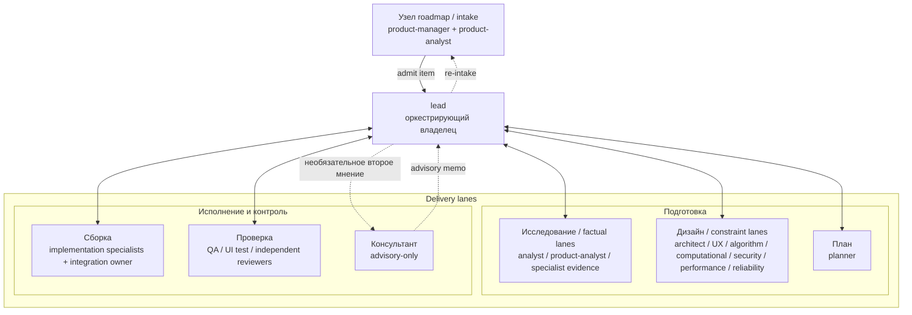
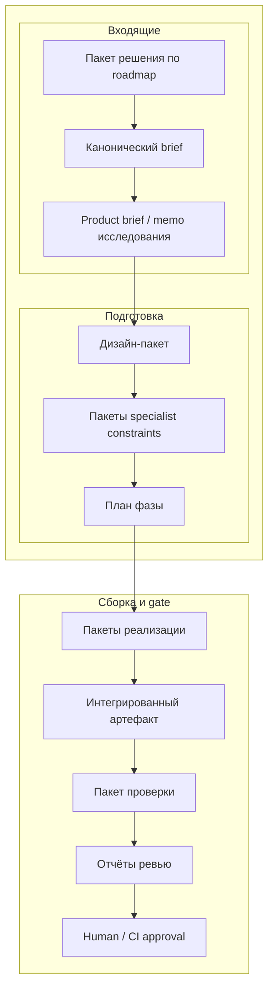
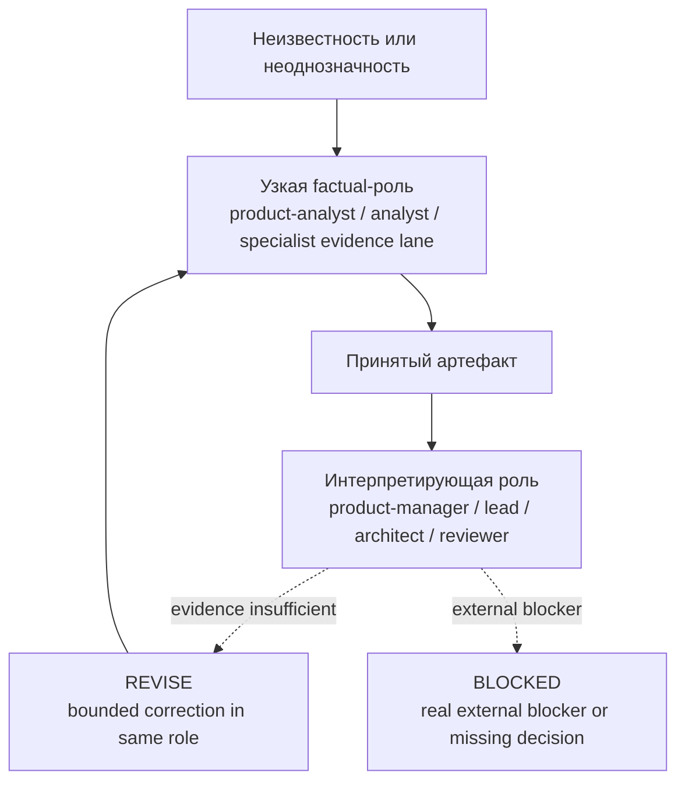

# Диаграмма operating model

Этот файл — визуальное дополнение к [subagent-operating-model.md](subagent-operating-model.md).
Справочник по стратегиям: [workflow-strategy-comparison.md](workflow-strategy-comparison.md).

## 1. Сквозной operating flow

## 2. Топология взаимодействия

## 3. Прогрессия артефактов

## 4. Поведение делегирования

## 5. Таблица выбора workflow

| Ситуация | Дефолтная стратегия | Основные роли | Ожидаемый принятый артефакт | Когда эскалировать |
|---|---|---|---|---|
| Что должно войти в discovery или delivery следующим? | `Roadmap / Intake loop` | `$product-manager`, `$product-analyst` по необходимости | Roadmap decision package, затем при необходимости product brief | Product facts неясны или milestone intent нестабилен |
| Утверждённый item требует обычного исполнения | `Delivery loop` | `$lead -> analyst -> architect -> planner -> implementation -> QA/review` | Canonical brief, research memo, design package, phase plan, implementation и verification artifacts | Нужен критичный risk lane или независимый reviewer |
| Следующее решение блокируется нехваткой фактов | `Fact-first routing` | `$analyst`, `$product-analyst` или узкий specialist evidence lane | Принятый factual artifact | Interpretive роли начинают гадать вместо того, чтобы потреблять evidence |
| Domain risk может независимо провалить результат | `Risk-owner routing` | `$security-engineer`, `$performance-engineer`, `$reliability-engineer`, `$algorithm-scientist`, `$computational-scientist`, `$ux-designer` или другой явный owner | Один specialist design или constraint package | Риск остаётся неявным внутри общей реализации |
| Принятый item materially изменился в середине delivery | `Re-intake loop` | `$lead -> $product-manager -> $lead` | Обновлённый roadmap decision package или решение о повторном допуске | Scope, priority или milestone intent больше не совпадают с admitted item |
| Несколько implementation-фаз или специалистов должны слиться в один результат | `Integration ownership` | `$lead` плюс один явный integration owner | Один интегрированный артефакт, готовый к QA | QA получил бы частичный multi-phase результат |
| Известный bounded risk нуждается в независимой проверке | `Claim-Verify review` | Builder upstream и релевантный независимый reviewer | Implementation artifact плюс список claims, затем review report | Reviewer должен проверить заявленные guarantees и gaps покрытия |
| Новый или внешне exposed risk требует поиска blind spots | `Adversarial review` | Релевантный независимый reviewer | Review report только по implementation artifact | Пропустить unknown risk опаснее, чем execution bug |
| Изменение требует независимости между builder и gate | `Builder / blocker separation` | Builder role плюс reviewer/blocker role | Builder artifact, затем независимый review artifact | Builder сам одобрял бы тот же риск, который и внёс |
| Неоднозначность или tradeoff'ы требуют не блокирующего второго мнения | `Consultant advisory` | `$lead -> $consultant` | Advisory memo | Факты уже собраны, но выбор маршрута остаётся неоднозначным |
| Read-heavy области независимы | `Parallel read lanes` | Несколько research, triage или test-analysis ролей | Несколько независимых factual artifacts | Стоимость синтеза выше, чем выигрыш по времени |
| Write-heavy области независимы, а contracts зафиксированы | `Parallel write lanes` | Несколько implementation-ролей с раздельным ownership | Несколько implementation artifacts с фиксированными границами | Write scopes пересекаются или contracts ещё двигаются |

## 6. Карта ролей по категориям

Текущий состав команды: `31 роль`, `6 категорий`.

| Категория | Роли |
|---|---|
| Координация | `lead`, `product-manager`, `consultant` (advisory-only) |
| Исследование | `analyst`, `product-analyst` |
| Дизайн / ограничения | `architect`, `ux-designer`, `algorithm-scientist`, `computational-scientist`, `security-engineer`, `performance-engineer`, `reliability-engineer` |
| Планирование | `planner` |
| Реализация | `backend-engineer`, `frontend-engineer (web/React UI)`, `data-engineer`, `platform-engineer`, `toolchain-engineer`, `graphics-engineer`, `visualization-engineer`, `geometry-engineer`, `qt-ui-engineer (Qt desktop UI)`, `model-view-engineer`, `knowledge-archivist` |
| QA + ревью | `qa-engineer`, `ui-test-engineer`, `architecture-reviewer`, `performance-reviewer`, `security-reviewer`, `ux-reviewer`, `accessibility-reviewer` |

Примечания:
- `knowledge-archivist` — это сквозная hygiene-роль, и обычно её вызывают вне основной feature-фазы, хотя она находится ближе всего к support implementation.
- `consultant` — advisory-only и не становится обязательным delivery gate.

## 7. Примечания к чтению

- `product-manager` владеет тем, что входит в discovery или delivery.
- `lead` владеет исполнением утверждённой работы.
- `ux-designer` владеет ограниченным interaction design до implementation, когда UI surface требует отдельного UX ownership.
- Если in-flight item больше не соответствует своему admitted scope, priority или milestone intent, `lead` возвращает его `product-manager` для re-intake.
- `analyst` и `product-analyst` должны снижать неопределённость до того, как interpretive роли начнут принимать tradeoff-решения.
- Делегирование должно уменьшать шум: передавайте принятые артефакты, а не сырые transcript dumps, если уже существует принятый артефакт.
- Interpretive роли должны потреблять принятый evidence, а не закрывать factual gaps за счёт judgment.
- Субагенты обмениваются принятыми артефактами, а не прямыми peer task assignments.
- `$consultant` остаётся advisory-only независимо от того, исполняется ли он внешним провайдером или внутренним независимым subagent fallback.
- Multi-phase или multi-specialist implementation требует одного explicit integration owner до QA.
- Reviewer'ы остаются независимыми и отчитываются оркестрирующему owner'у.
- `REVISE` возвращает работу к тому же stage owner'у; `BLOCKED` останавливает progression до появления нового решения или артефакта.
